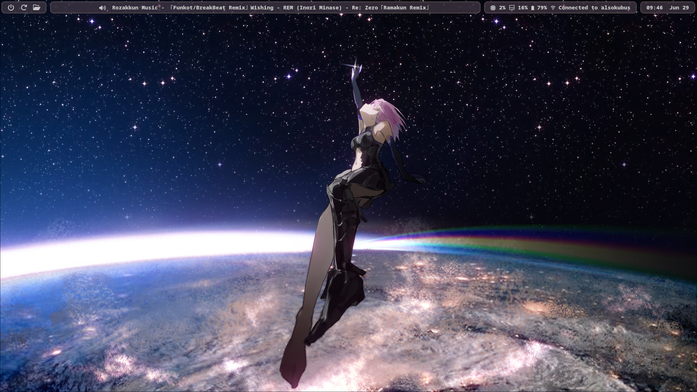

# le-widget

My Take on Making A Simple Bar Using Elkowar's Wacky Widget on Hyprland

# How To Install

  1. Install [Eww](https://github.com/elkowar/eww/)
  2. Put /eww contents into .config/
  3. Start ./eww open bar
