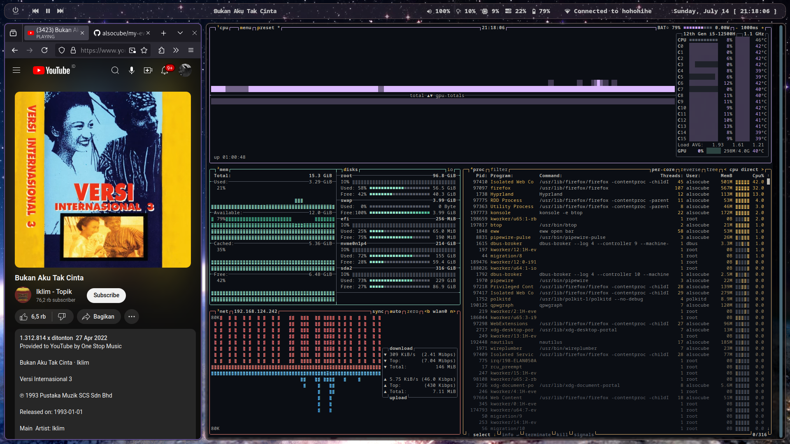

# Ayo?! Eww!!

My simple, mostly "inspired", bar made with [Elkowar's Wacky Widget](https://github.com/elkowar/eww/) in Arch + Hyprland

I'm using XWayland, you might need to change some config accordingly.

[Eww Wiki](https://elkowar.github.io/eww/)

# Showcases



# How To Install

  1. Install [Eww](https://github.com/elkowar/eww/)
  2. Put /eww into your ~/.config/
  3. Install the font (check your distro wiki or if you use [arch](https://wiki.archlinux.org/title/Fonts#Manual_installation))
  4. Start with eww open bar

# Troubleshoot

• [Font missing]
Try installing noto-fonts and noto-fonts-emoji and phosphor icon

• [Scripts not running]
Take a look on your eww logs, if stated "permission denied" then
```
chmod +x [all scripts files]
```

• [Hyprland not reserving space for bar]
Let's assume you're using X11, then modify eww.yuck geometry
```
##delete##
...
:exclusive true
...
##change to##
...
:reserve (struts :distance "[int e.g 40px]" :side "top center")
:
```
