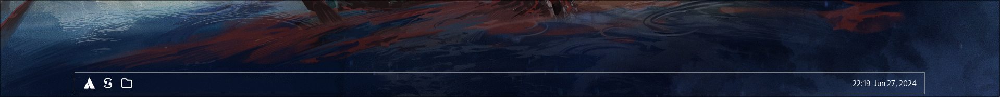

# le-widget

My Take on Making A Simple Bar Using Elkowar's Wacky Widget on Hyprland

# How To Install

  1. Install [Eww](https://github.com/elkowar/eww/)
  2. Put .yuck and .scss to .config/eww/
  3. Start ./eww
