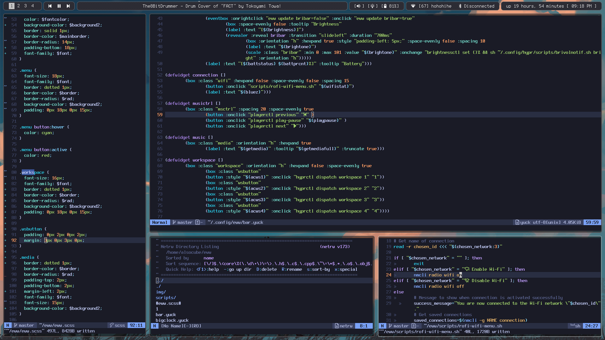

# Ayo?! Eww!!

My simple, mostly "inspired" by others, bar made with [Elkowar's Wacky Widget](https://github.com/elkowar/eww/) in Arch + Hyprland

I'm using XWayland, you might need to change some config accordingly. [Eww Wiki](https://elkowar.github.io/eww/)

# Showcases

wallpaper made by [TofuDofu](https://www.pixiv.net/en/users/66739964) https://www.pixiv.net/en/artworks/113157989

# How To Install

  1. Install [Eww](https://github.com/elkowar/eww/)
  2. Clone this repo
  3. Put /eww into your ~/.config/
  4. Install [Terminus](https://sourceforge.net/projects/terminus-font/files/) & [Noto family](https://archlinux.org/packages/extra/any/noto-fonts/) font & probably Nerd Font (check your distro repo/wiki)
  6. Start with eww open-many bar bigtime bigtimetip pcres
